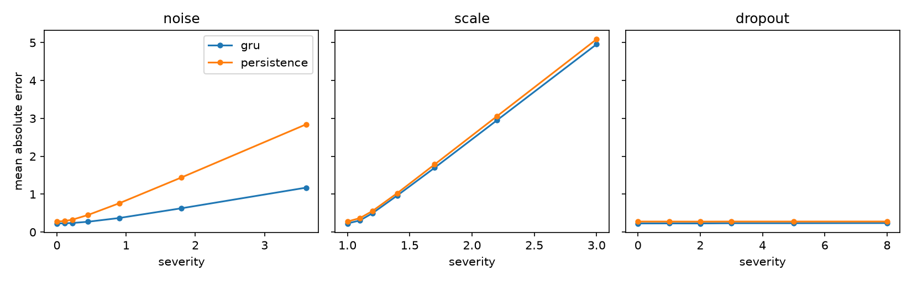
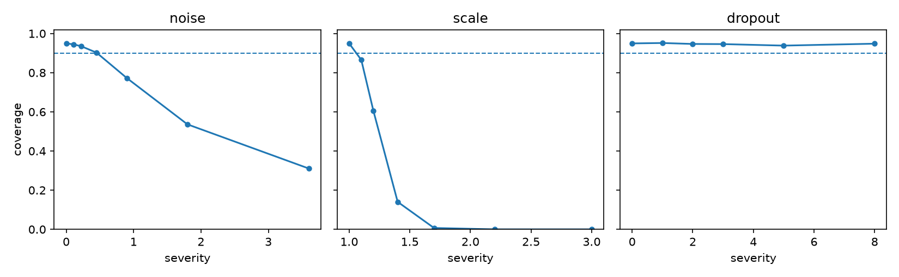

# Drift Bench

How much sensor trouble does a short-horizon indoor PM2.5 forecast survive?

A forecaster trained on the S.M.A.R.T. Construction Research Group's published sensor data, then broken on purpose to find out. Three failure modes: noise, dropped readings, and a gain change. The noise and dropout severities were measured from the sensors themselves, and the gain factors are set to the disagreement observed between the two devices, so the numbers below correspond to things these instruments actually do.

## Layout

```
core_settings.py      tunable values, exposed as functions
ingest.py             load both sensor exports onto one clock
agreement.py          how far apart the two sensors are, and how much is noise
gaps.py               where the missing readings are and what they cost
forecasting.py        sliding windows, a persistence baseline, a small GRU
perturbations.py      the three corruptions, as pure functions
robustness.py         sweep each corruption, record the error
conformal.py          size a prediction interval, test its coverage under corruption
scripts/run_all.py    entry point
tests/                twenty hermetic unit tests
```

## Data

Two windows from [`SMART-NYUAD/Indoor_Dataset_Atmocube_NYUAD`](https://github.com/SMART-NYUAD/Indoor_Dataset_Atmocube_NYUAD), which this repo does not copy. A bio lab, 1 to 4 June 2025. The SMART lab, 28 July to 4 August 2025. Both windows have two devices sitting in the same room: a commercial Atmocube, and a SEN55 unit the group built themselves. Not the same SEN55. Unit 7 in June, unit 2 in August. Different build, different room, six weeks apart, so nothing here separates the device from the room from the period.

The two exports are not in the same format. June has raw timestamps, and the devices don't fire at the same second — the SEN55 stamps at :36 past the minute, the Atmocube at :51. August comes already rounded. `ingest.py` reads both. It rounds onto a 60-second grid and averages whatever lands in the same bucket, which is what `query_code_2.py` does.

## Setup

```bash
python -m venv .venv
.venv\Scripts\Activate.ps1        # source .venv/bin/activate on macOS/Linux
pip install -r requirements.txt
git clone https://github.com/SMART-NYUAD/Indoor_Dataset_Atmocube_NYUAD.git data_raw
```

## Run

```bash
python -m scripts.run_all          # ~2 minutes, writes figures/
python -m unittest discover -s tests -p "test_*.py"
```

## Results

60 minutes of history, 30 minutes ahead, chronological 70/15/15 split. The August GRU gets a mean absolute error of 0.228 µg/m³. A persistence baseline, which just repeats the last reading, gets 0.278.

Then the model is frozen and the test inputs are corrupted. Nothing is retrained.

| failure mode | severity, anchored on the sensors | forecast MAE | 90% interval coverage |
|---|---|---|---|
| none | — | 0.228 | 0.949 |
| dropout | realistic outage lengths, 8/hour | 0.238 | 0.948 |
| noise | σ = 0.45 µg/m³ | 0.273 | 0.902 |
| scale | 1.7× (June median ratio) | 1.698 | 0.007 |
| scale | 2.2× (August median ratio) | 2.950 | 0.000 |



*Error as each failure mode is turned up. Blue is the GRU, orange the persistence baseline. Dropout is flat, noise separates the two models, scaling takes both straight up.*



*Coverage of the 90% interval, dashed line at the promise. It holds under dropout and noise and falls through the floor under scaling.*

The two sensors disagree differently depending on the channel. Temperature is an offset of about 3 °C, and two separately built units land within 0.11 °C of each other. PM2.5 does not reproduce that way. The median per-minute ratio is 1.71 in June and 2.21 in August, and the gap grows with concentration.

These are different units, so this is not one instrument drifting. It is two hand-built devices disagreeing with the same commercial reference by different amounts, which for a campus twin is the more awkward version: readings from two rooms are not on the same scale.

How much it changed depends on how you measure it. Median of ratios gives +29%, mean of ratios +28%, ratio of means +21%, a slope through the origin +13%. A slope fitted with an intercept goes the other way at −12%, because the intercept moves from −1.27 to +1.33. Four of five agree on the direction. None can be checked against truth.

The interval width is 1.134 in every row of that table, including the rows where it never contains the truth. Nothing widens. Nothing warns.

Under scaling the GRU does no better than the one-line baseline. It can't. A single sensor reporting high numbers looks the same whether the air got dirty or the instrument drifted, so there is nothing in the input to tell them apart. Two sensors in the same room would. `agreement.py` computes the difference, and `ratio_summary` computes the gain you'd watch.

## Limitations

- No ground truth. Two uncalibrated devices measured against each other. This shows how much they disagree. It cannot show which one is closer to correct.
- The two windows use different SEN55 units, 7 and 2, in different rooms. Device, room and period change together, so the change in PM2.5 gain cannot be attributed to any one of them.
- Two rooms, 2.7 days and 7.3 days. One forecast target. Both devices report nearly the same number for PM1, PM2.5, PM4 and PM10, so those four columns are really one signal.
- The `drift_per_day` column in the agreement table is not measuring the instrument. PM disagreement scales with concentration, so a straight line fitted to it mostly tracks how busy the room was.
- Bland–Altman assumes each point is an independent measurement. Readings a minute apart are not, which is why those plots trace loops. The temperature panels have a second problem: the room only moves 0.6 °C across a week, so there is no range to detect level dependence in.
- June's GRU has more parameters than it has training examples. It barely responds to its input, and that is why it scores well on robustness. Clean error appears next to every ratio for this reason.
- This is a sweep. It says nothing about severities it didn't test, and no bound is proved.
